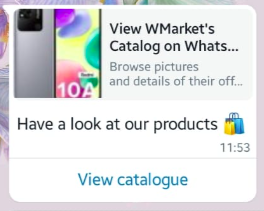

# Chatterbox

Chatterbox is a Python library for sending WhatsApp messages using the WhatsApp Cloud API.

Supported features:

!todo react to message

- Sending messages (text, image, audio, video, document, location, reaction)
- Processing incoming messages (text, image, audio, video, document, location)
- Managing product catalog
- Sharing product catalog
- Processing cart orders

## Table of contents

- [Chatterbox](#chatterbox)
  - [Table of contents](#table-of-contents)
  - [Getting started](#getting-started)
    - [Installation](#installation)
    - [Creating WhatsApp instance](#creating-whatsapp-instance)
  - [Sending messages](#sending-messages)
    - [Send text message](#send-text-message)
    - [Send text message with context (replying to a message)](#send-text-message-with-context-replying-to-a-message)
    - [Send reaction](#send-reaction)
    - [Send image](#send-image)
    - [Send location](#send-location)
    - [Send interactive buttons](#send-interactive-buttons)
    - [Send interactive list](#send-interactive-list)
  - [Sending catalog messages](#sending-catalog-messages)
    - [Update catalog status](#update-catalog-status)
    - [Update cart status](#update-cart-status)
    - [Check commerece settings](#check-commerece-settings)
    - [Send product catalog](#send-product-catalog)
    - [Send single product from catalog](#send-single-product-from-catalog)
    - [Send list of products from catalog](#send-list-of-products-from-catalog)
  - [Processing incoming messages](#processing-incoming-messages)
    - [Supported message types](#supported-message-types)
    - [User object](#user-object)
    - [Text messages](#text-messages)
    - [Order messages](#order-messages)
    - [Interactive messages](#interactive-messages)

## Getting started

### Installation

To install the library, run the following command:

```console
pip install name
```

### Creating WhatsApp instance

Before sending messages, you need to configure the access token and phone number id. You can find these values in your Meta Apps dashboard.

```python
from chatterbox import WhatsApp

whatsapp = WhatsApp(access_token="WHATSAPP_ACCESS_TOKEN", phone_number_id="WHATSAPP_PHONE_NUMBER_ID")
```

## Sending messages

### Send text message

To send a basic text message, use the `send_text` method. You'll need to provide the recipient's phone number and the text message.

```python
whatsapp.send_text(to="phone_number", text="Hello world!")
```

### Send text message with context (replying to a message)


To reply to a message, use the `send_text` method. You'll need to provide the recipient's phone number, the text message, and the message id of the message you're replying to.

```python
whatsapp.send_text(
  to="phone_number",
  body="You've been replied",
  context_message_id="message_id",
)
```

### Send reaction


To react to a message, use the `send_reaction` method. You'll need to provide the recipient's phone number, the message id, and the emoji to use.

```python
whatsapp.send_reaction(to="phone_number", message_id="wamid.abc123", emoji="👍")
```

### Send image


To send an image, use the `send_image` method. You'll need to provide the recipient's phone number and the image url. The `caption` parameter is optional.

```python
whatsapp.send_image(
  to="phone_number",
  url="https://images.unsplash.com/photo-1622618760546-8e443f8a909b?ixlib=rb-4.0.3&ixid=M3wxMjA3fDB8MHxzZWFyY2h8Mnx8c2hpYmElMjBpbnV8ZW58MHx8MHx8fDA%3D&auto=format&fit=crop&w=500&q=60",
  caption="So much wow",
)
```

### Send location


To send a location, use the `send_location` method. You'll need to provide the recipient's phone number, the location name, the location address, and the latitude and longitude coordinates.

```python
whatsapp.send_location(
  to="phone_number",
  name="Google head offices",
  address="1600 Amphitheatre Parkway, Mountain View, CA",
  latitude="37.422",
  longitude="-122.084",
)
```

### Send interactive buttons


To send interactive buttons, use the `send_interactive_buttons` method. You'll need to provide the recipient's phone number, the message body, and a list of ReplyButtons. The `id` parameter is the button id, and the `title` parameter is the button text.

```python
from chatterbox.messages.components import ReplyButton

whatsapp.send_interactive_buttons(
  to="phone_number",
  body="Confirm your purchase",
  buttons=[
    ReplyButton(id="confirm", title="Confirm"),
    ReplyButton(id="cancel", title="Cancel"),
  ],
)
```

### Send interactive list

Interactive list


Interactive list options


To send an interactive list, use the `send_interactive_list` method. You'll need to provide the recipient's phone number, the message body, and a list of ListSections. The ListSection contains a list of SectionRows.

The SectionRow `id` parameter is the row id, the `title` parameter is the row title, and the `description` parameter is the row description.

The `header` paramater is optional and is used to display a header above the list.

```python
from chatterbox.messages.components import ListSection, SectionRow

whatsapp.send_interactive_list(
  to="phone_number",
  header="Payment options",
  body="Select a payment option 🧾",
  button="Options",
  sections=[
    ListSection(
      title="Mobile money 📱",
      rows=[
        SectionRow(id="pay_with_ecocash", title="EcoCash", description="Pay with EcoCash"),
        SectionRow(id="pay_with_onemoney", title="OneMoney", description="Pay with OneMoney")
      ],
    ),
    ListSection(
      title="Bank transfer 💳",
      rows=[
        SectionRow(id="pay_with_visa", title="Visa"),
        SectionRow(id="pay_with_mastercard", title="MasterCard"),
      ],
    ),
  ],
)
```

## Sending catalog messages

Requirements:

1. You need to have a WhatsApp Business account linked with an actual phone number (not the test number provided by Meta).
2. You need to have a product catalog created in your [Commerce Manager](https://business.facebook.com/commerce).
3. You need to link your WhatsApp Business account with your catalog.
4. You need to enable your [catalog status](#update-catalog-status) to `true` and your [cart status](#update-cart-status) to `true`. To check if these are enabled, [call the `commerce_settings` method](#check-commerece-settings).

### Update catalog status

To update the catalog status, use the `update_catalog_status` method. You'll need to provide the catalog visibility status.

```python
whatsapp.update_catalog_status(is_catalog_visible=True)
```

### Update cart status

To update the cart status, use the `update_cart_status` method. You'll need to provide the cart visibility status.

```python
whatsapp.update_cart_status(is_cart_visible=True)
```

### Check commerece settings

To check the commerce settings, use the `commerce_settings` method.

```python
whatsapp.commerce_settings()
```

### Send product catalog



To send a product catalog, use the `send_product_catalog` method. You'll need to provide the recipient's phone number, the catalog title, and a list of CatalogItems. The CatalogItem contains a list of CatalogItemButtons.

```python
whatsapp.send_catalog(to="phone_number",  body="Have a look at our products 🛍")
```

### Send single product from catalog


To send a single product from a catalog, use the `send_catalog_product` method. You'll need to provide the recipient's phone number, the catalog id, the product id, and body text.

```python
whatsapp.send_catalog_product(
  to="recipient_phone",
  catalog_id="catalog_id",
  product_retailer_id="product_id",
  body="Samsung Galaxy M04",
)
```

### Send list of products from catalog


To send a list of products from a catalog, use the `send_catalog_product_list` method. You'll need to provide the recipient's phone number, the catalog id, the header text, the body text, and a list of CatalogSections. The CatalogSection contains a section title and a list of retailer product ids.

```python
whatsapp.send_catalog_product_list(
   to="phone_number",
   catalog_id="123",
   header="Products",
   body="Select a product and add it to the cart 🛒",
   product_sections=[
       CatalogSection(title="Phones", retailer_product_ids=["product_id_1"]),
       CatalogSection(title="Frequently bought with", retailer_product_ids=["product_id_2", "product_id_3"]),
   ],
)
```

## Processing incoming messages

NB: The following examples are using [Flask](https://flask.palletsprojects.com)


When a user sends a message to your WhatsApp number, you'll receive a post request to your webhook. To process the message, use the `parse` method. You'll need to provide the request data.

```python
from chatterbox.messages.types import MessageType

class GroupAPI(MethodView):
 init_every_request = False

 def get(self):
  # verify access token

 def post(self):
   message = whatsapp.parse(request.data)

   if not isinstance(message, NoneType):

       # process text message
      if message.type == MessageType.TEXT:
        # do something with text message

      if message.type == MessageType.Order:
        # do something with order message
```

### Supported message types

- Order - `MessageType.ORDER`
- Text - `MessageType.TEXT`
- Interactive - `MessageType.INTERACTIVE`
- Image - `MessageType.IMAGE`
- Location - `MessageType.LOCATION`
- Video - `MessageType.VIDEO`

### User object

All incoming messages have a `user` property. The user object contains the following properties:

- `name: str` - The user's name on WhatsApp
- `phone_number: str` = The user's phone number. Useful when you want to reply to the user's message.

### Text messages

If the message type is `MessageType.TEXT`, you can access thefollowing properties:

- `id: str` - The message id e.g. `wamid.abc123`
- `user: User` - The [user object](#user-object)
- `context_message_id: str` - The message id of the message the user replied to e.g. `wamid.abc123`
- `timestamp: str` - The time the message was sent by the user e.g. `1696669497`
- `type: str` - The message type e.g. `MessageType.TEXT`. Type is always a [`MessageType`](#supported-message-types) enum value. 
- `body: str` - The message body e.g. `Hello there!`

### Order messages

Users can use the WhatsApp cart to place orders. If the message type is `MessageType.ORDER`, you can access thefollowing properties:

- `id: str` - The message id e.g. `wamid.abc123`
- `user: User` - The [user object](#user-object)
- `timestamp: str` - The time the message was sent by the user e.g. `1696669497`
- `type: str` - The message type e.g. `MessageType.TEXT`. Type is always a [`MessageType`](#supported-message-types) enum value.
- `catalog_id: str` - The ID of the catalog the user ordered from e.g. `123`
- `products: List[Product]` - A list of products the user ordered. Each product has the following properties:
  - `id: str` - The product id e.g. `product_id_1`
  - `quantity: int` - The quantity of the product ordered e.g. `2`
  - `price: float` - The price of the product at the time it was ordered e.g. `10.99`
  - `currency: str` - The currency of the product price e.g. `ZWL`

### Interactive messages

Both interactive buttons and interactive lists return the same message type. If the message type is `MessageType.INTERACTIVE`, you can access thefollowing properties:

- `id: str` - The message id e.g. `wamid.abc123`
- `user: User` - The [user object](#user-object)
- `context_message_id: str` - The message id of the message the user replied to. In this case it's the interactive message. Message id e.g. `wamid.abc123`
- `timestamp: str` - The time the message was sent by the user e.g. `1696669497`
- `type: str` - The message type e.g. `MessageType.TEXT`. Type is always a [`MessageType`](#supported-message-types) enum value.
- `reply_id: str` - The id of the button or list item the user clicked e.g. `pay_with_ecocash`
- `title: str` - The title of the button or list item the user clicked e.g. EcoCash
- `description: str` - The description of the list item the user clicked e.g. Phone number required
