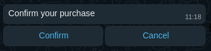

# WA Cloud Py

wa_cloud_py is a Python library for sending WhatsApp messages using the WhatsApp Cloud API.

Supported features:

- Sending messages (text, image, audio, video, document, location, reaction)
- Processing incoming messages (text, image, audio, video, document, location)
- Managing product catalog
- Sharing product catalog
- Processing cart orders

## Table of contents

- [WA Cloud Py](#wa-cloud-py)
  - [Table of contents](#table-of-contents)
  - [Getting started](#getting-started)
    - [Installation](#installation)
    - [Creating WhatsApp instance](#creating-whatsapp-instance)
  - [Sending messages](#sending-messages)
    - [Send text message](#send-text-message)
    - [Send text message with context (replying to a message)](#send-text-message-with-context-replying-to-a-message)
    - [Send reaction](#send-reaction)
    - [Send image](#send-image)
    - [Send location](#send-location)
    - [Send interactive buttons](#send-interactive-buttons)
    - [Send interactive list](#send-interactive-list)
  - [Sending catalog messages](#sending-catalog-messages)
    - [Update catalog status](#update-catalog-status)
    - [Update cart status](#update-cart-status)
    - [Check commerece settings](#check-commerece-settings)
    - [Send product catalog](#send-product-catalog)
    - [Send single product from catalog](#send-single-product-from-catalog)
    - [Send list of products from catalog](#send-list-of-products-from-catalog)
  - [Processing incoming messages](#processing-incoming-messages)
    - [User messages vs Message status](#user-messages-vs-message-status)
    - [User object](#user-object)
    - [Text messages](#text-messages)
    - [Order messages](#order-messages)
    - [Interactive messages](#interactive-messages)
    - [Message status](#message-status)
  - [Update business profile](#update-business-profile)

## Getting started

### Installation

To install the library, run the following command:

```console
pip install wa_cloud_py
```

### Creating WhatsApp instance

Before sending messages, you need to configure the access token and phone number id. You can find these values in your Meta Apps dashboard.

```python
from wa_cloud_py import WhatsApp

whatsapp = WhatsApp(access_token="WHATSAPP_ACCESS_TOKEN", phone_number_id="WHATSAPP_PHONE_NUMBER_ID")
```

## Sending messages

### Send text message

To send a basic text message, use the `send_text` method. You'll need to provide the recipient's phone number and the text message.

```python
whatsapp.send_text(to="phone_number", text="Hello world!")
```

### Send text message with context (replying to a message)


To reply to a message, use the `send_text` method. You'll need to provide the recipient's phone number, the text message, and the message id of the message you're replying to.

```python
whatsapp.send_text(
  to="phone_number",
  body="You've been replied",
  context_message_id="message_id",
)
```

### Send reaction


To react to a message, use the `send_reaction` method. You'll need to provide the recipient's phone number, the message id, and the emoji to use.

```python
whatsapp.send_reaction(to="phone_number", message_id="wamid.abc123", emoji="😲")
```

### Send image


To send an image, use the `send_image` method. You'll need to provide the recipient's phone number and the image url. The `caption` parameter is optional.

```python
whatsapp.send_image(
  to="phone_number",
  url="https://images.unsplash.com/photo-1622618760546-8e443f8a909b?ixlib=rb-4.0.3&ixid=M3wxMjA3fDB8MHxzZWFyY2h8Mnx8c2hpYmElMjBpbnV8ZW58MHx8MHx8fDA%3D&auto=format&fit=crop&w=500&q=60",
  caption="So much wow",
)
```

### Send location


To send a location, use the `send_location` method. You'll need to provide the recipient's phone number, the location name, the location address, and the latitude and longitude coordinates.

```python
whatsapp.send_location(
  to="phone_number",
  name="Google head offices",
  address="1600 Amphitheatre Parkway, Mountain View, CA",
  latitude="37.422",
  longitude="-122.084",
)
```

### Send interactive buttons



To send interactive buttons, use the `send_interactive_buttons` method. You'll need to provide the recipient's phone number, the message body, and a list of ReplyButtons. The `id` parameter is the button id, and the `title` parameter is the button text.

```python
from wa_cloud_py.message_components import ReplyButton

whatsapp.send_interactive_buttons(
  to="phone_number",
  body="Confirm your purchase",
  buttons=[
    ReplyButton(id="confirm", title="Confirm"),
    ReplyButton(id="cancel", title="Cancel"),
  ],
)
```

### Send interactive list

Interactive list


Interactive list options


To send an interactive list, use the `send_interactive_list` method. You'll need to provide the recipient's phone number, the message body, and a list of ListSections. The ListSection contains a list of SectionRows.

The SectionRow `id` parameter is the row id, the `title` parameter is the row title, and the `description` parameter is the row description.

The `header` paramater is optional and is used to display a header above the list.

```python
from wa_cloud_py.message_components import ListSection, SectionRow

whatsapp.send_interactive_list(
  to="phone_number",
  header="Payment options",
  body="Select a payment option 🧾",
  button="Options",
  sections=[
    ListSection(
      title="Mobile money 📱",
      rows=[
        SectionRow(id="pay_with_ecocash", title="EcoCash", description="Pay with EcoCash"),
        SectionRow(id="pay_with_onemoney", title="OneMoney", description="Pay with OneMoney")
      ],
    ),
    ListSection(
      title="Bank transfer 💳",
      rows=[
        SectionRow(id="pay_with_visa", title="Visa"),
        SectionRow(id="pay_with_mastercard", title="MasterCard"),
      ],
    ),
  ],
)
```

## Sending catalog messages

Requirements:

1. You need to have a WhatsApp Business account linked with an actual phone number (not the test number provided by Meta).
2. You need to have a product catalog created in your [Commerce Manager](https://business.facebook.com/commerce).
3. You need to link your WhatsApp Business account with your catalog.
4. You need to enable your [catalog status](#update-catalog-status) to `true` and your [cart status](#update-cart-status) to `true`. To check if these are enabled, [call the `commerce_settings` method](#check-commerece-settings).

### Update catalog status

To update the catalog status, use the `update_catalog_status` method. You'll need to provide the catalog visibility status.

```python
whatsapp.update_catalog_status(is_catalog_visible=True)
```

### Update cart status

To update the cart status, use the `update_cart_status` method. You'll need to provide the cart visibility status.

```python
whatsapp.update_cart_status(is_cart_visible=True)
```

### Check commerece settings

To check the commerce settings (cart and catalog status), use the `commerce_settings` method.

```python
whatsapp.commerce_settings()
```

### Send product catalog


Useful when you want to give the user a list of all available products.

To send a product catalog, use the `send_product_catalog` method. You'll need to provide the recipient's phone number, the catalog title, and a list of CatalogItems. The CatalogItem contains a list of CatalogItemButtons.

```python
whatsapp.send_catalog(to="phone_number",  body="Have a look at our products 🛍")
```

### Send single product from catalog


To send a single product from a catalog, use the `send_catalog_product` method. You'll need to provide the recipient's phone number, the catalog id, the product id, and body text.

```python
whatsapp.send_catalog_product(
  to="recipient_phone",
  catalog_id="catalog_id",
  product_retailer_id="product_id",
  body="Samsung Galaxy M04",
)
```

### Send list of products from catalog


Useful when you want to give the user a filtered list of products. For example showing the user a list of products that closely match their search query.

To send a list of products from a catalog, use the `send_catalog_product_list` method. You'll need to provide the recipient's phone number, the catalog id, the header text, the body text, and a list of CatalogSections. The CatalogSection contains a section title and a list of retailer product ids.

```python
whatsapp.send_catalog_product_list(
   to="phone_number",
   catalog_id="123",
   header="Products",
   body="Select a product and add it to the cart 🛒",
   product_sections=[
       CatalogSection(title="Phones", retailer_product_ids=["product_id_1"]),
       CatalogSection(title="Frequently bought with", retailer_product_ids=["product_id_2", "product_id_3"]),
   ],
)
```

## Processing incoming messages

NB: The following examples are using [Flask](https://flask.palletsprojects.com)

When a user sends a message to your WhatsApp number, you'll receive a post request to your webhook. To process the message, use the `parse` method. You'll need to provide the request data.

```python
from wa_cloud_py import WhatsApp
from wa_cloud_py.message_types import MessageStatus, UserMessage
from flask import request
from flask.views import MethodView


class GroupAPI(MethodView):
    init_every_request = False

    def get(self):
        #verify token
        pass

    def post(self):
        whatsapp = WhatsApp(access_token="access_token", phone_number_id="phone_number_id")
        message = whatsapp.parse(request.data)

        # check if a the message was sent by a user
        if isinstance(message, UserMessage):

            # process text message
            if isinstance(message, TextMessage):
               message_sent, res = whatsapp.send_text(
                   to=message.user.phone_number,
                   body="Hello World",
               )

            # process order
            if isinstance(message, OrderMessage):
                pass

        # print status of message you sent to the user
        elif isinstance(message, MessageStatus):
            print(message)

        # handle unsupported message types
        else:
            print("Unsupported message type")

        return "", 200


wa_webhook = GroupAPI.as_view(f"WaWebhook")
```

### User messages vs Message status

User messages are messages sent by a user. Message status are messages sent by the WhatsApp Cloud API to confirm the status of a message you sent to a user. All user messages inherit from the `UserMessage` class.

The following user message classes inherit from the `UserMessage` class:

- [`TextMessage`](#text-messages) - A text only message sent by the user to your WhatsApp number.
- [`InteractiveMessage`](#interactive-messages) - A message sent by the user when they click on an interactive button or list item.
- [`OrderMessage`](#order-messages) - A message sent by the user when they place an order using the WhatsApp cart.
- `ImageMessage` - A message sent by the user when they send an image.
- `AudioMessage` - A message sent by the user when they send an audio file.
- `DocumentMessage` - A message sent by the user when they send a document.

### User object

All incoming user messages have a `user` property. The user object contains the following properties:

- `name: str` - The user's name on WhatsApp
- `phone_number: str` = The user's phone number. Useful when you want to reply to the user's message.

### Text messages

```python
#process text message
if isinstance(message, TextMessage):
    pass
```

When the user sends a text message, you'll receive a `TextMessage` object. If the message type is `MessageType.TEXT`, you can access the following properties:

- `id: str` - The message id e.g. `wamid.abc123`
- `user: User` - The [user object](#user-object)
- `context_message_id: str` - The message id of the message the user replied to e.g. `wamid.abc123`
- `timestamp: str` - The time the message was sent by the user e.g. `1696669497`
- `type: str` - The message type e.g. `text`
- `body: str` - The message body e.g. `Hello there!`

### Order messages

```python
#process order
if isinstance(message, OrderMessage):
    pass
```

Users can use the WhatsApp cart to place orders. If the message type is `MessageType.ORDER`, you can access thefollowing properties:

- `id: str` - The message id e.g. `wamid.abc123`
- `user: User` - The [user object](#user-object)
- `timestamp: str` - The time the message was sent by the user e.g. `1696669497`
- `type: str` - The message type e.g. `order`
- `catalog_id: str` - The ID of the catalog the user ordered from e.g. `123`
- `products: List[Product]` - A list of products the user ordered. Each product has the following properties:
  - `id: str` - The product id e.g. `product_id_1`
  - `quantity: int` - The quantity of the product ordered e.g. `2`
  - `price: float` - The price of the product at the time it was ordered e.g. `10.99`
  - `currency: str` - The currency of the product price e.g. `ZWL`

### Interactive messages

```python
#process message based on reply_id
if isinstance(message, InteractiveMessage):
    pass
```

When a user clicks on an interactive button or list item, you'll receive an interactive message. If the message type is `MessageType.INTERACTIVE`, you can access thefollowing properties:

- `id: str` - The message id e.g. `wamid.abc123`
- `user: User` - The [user object](#user-object)
- `context_message_id: str` - The message id of the message the user replied to. In this case it's the interactive message. Message id e.g. `wamid.abc123`
- `timestamp: str` - The time the message was sent by the user e.g. `1696669497`
- `type: str` - The message type e.g. `interactive`
- `reply_id: str` - The id of the button or list item the user clicked e.g. `pay_with_ecocash`
- `title: str` - The title of the button or list item the user clicked e.g. EcoCash
- `description: str` - The description of the list item the user clicked e.g. Phone number required

### Message status

When you send a message to a user, you'll receive 2 api calls from the WhatsApp Cloud API. The first call is to confirm that the message was sent to the user. The second call is to confirm that the message was delivered to the user.

The `MessageStatus` class contains the following properties:

- `id: str` - The id of the message you sent to the user e.g. `wamid.abc123`
- `status: str` - The status of the message. Can be one of the following values:
  - `sent` - The message was sent to the user (single tick)
  - `delivered` - The message was delivered to the user (double tick)
- `timestamp: str` - The time the message was sent to the user e.g. `1696669497`
- `recipient_phone: str` - The phone number of the user the message was sent to e.g. `263712345678`
- `billable: bool` - Whether the message was billable or not e.g. `True`
- `pricing_model: bool` - The pricing model used to bill the message e.g. `CBP` (Conversation Based Pricing)
- `message_category: str` - The message category used for billing. Can be one of the following values:
  - `service` - The message was sent for service purposes
  - `marketing` - The message was sent for marketing purposes
  - `utility` - The message was sent for utility purposes
  - `auth` - The message was sent for authentication purposes

## Update business profile

To update the business profile, use the `update_business_profile` method. You'll need to provide the business profile fields you want to update.

```python
from wa_cloud_py.verticals import BusinessVertical

whatsapp.update_business_profile(
  about="We sell the best products",
  email="support@business.com",
  address="1600 Amphitheatre Parkway",
  description="We sell the best products",
  websites=["https://business.com"],
  vertical=BusinessVertical.RETAIL,
)
```

The following are the supported BusinessVerticals: `UNDEFINED, OTHER, AUTO, BEAUTY, APPAREL, EDU, ENTERTAIN, EVENT_PLAN, FINANCE, GROCERY, GOVT, HOTEL, HEALTH, NONPROFIT, PROF_SERVICES, RETAIL, TRAVEL, RESTAURANT, NOT_A_BIZ`
